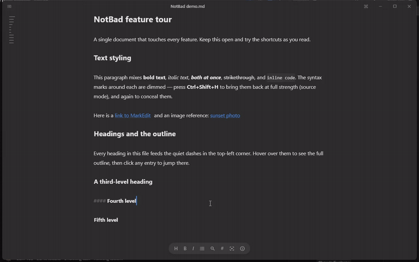
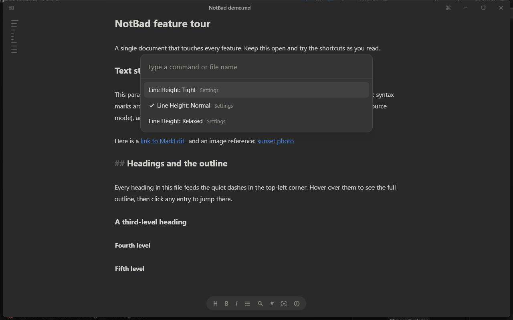

# NotBad

*A quiet place to write — now on every desktop.*

NotBad is a lightweight, cross-platform Markdown writer for **Windows, macOS, and Linux**, built with Flutter. It is a from-scratch port of [Trace](https://github.com/john-mrty/Trace) (itself built on the engine of [MarkEdit](https://github.com/MarkEdit-app/MarkEdit)), re-imagined as a **pure-Flutter app**: no embedded web view, no CodeMirror. The Markdown-aware editor is implemented natively in Dart, so the app starts fast, stays small (~28 MB), and behaves identically on every platform.



## Features

### Writing
- **Markdown styled as you type** — headings, bold, italic, strikethrough, inline code, code fences, links, lists, task checkboxes, blockquotes, and YAML frontmatter render live in the editor
- **Three view modes** (`Ctrl+Shift+H` cycles):
  1. *Styled, Marks Hidden* — syntax marks (`#`, `**`, `` ` ``…) disappear; the line under your caret reveals its marks so editing stays predictable
  2. *Styled with Marks* — styles applied, marks visible
  3. *Plain Markdown* — pure monospace source
- **Focus mode** (`Ctrl+Shift+F`) — dims everything except the paragraph you're working on, with **typewriter scrolling** that keeps the caret vertically centered
- **Smart lists** — Enter continues bullets, numbering, and `- [ ]` checkboxes; Enter on an empty item exits the list; Tab/Shift+Tab indent
- **Auto-pairing** — type a mark with text selected to wrap it; brackets and backticks auto-close
- **Smart typography** (optional) — curly quotes and `--` → em dash
- Click a checkbox to toggle it; Ctrl+click a link to open it

### Around the writing
- **Command palette** (`Ctrl+K`) — every action, fuzzy-searchable, with recent files
- **Open Document** (`Ctrl+Shift+O`) — jump to any file near your document by name, or **search across all their contents**
- **Find & replace** (`Ctrl+F` / `Ctrl+H`) — live match counts and highlights
- **File sidebar** (`Ctrl+\`) — keyboard-driven tree of the writing files around your document; watches the folder for changes
- **Hover table of contents** — quiet dashes top-left; hover for the outline, click to jump
- **Copy as Rich Text** (`Ctrl+Alt+C`) and **Export as HTML** — take the writing anywhere
- **Welcome screen** — recent files and New/Open on a fresh launch, gone the moment you type

### Trustworthy with your files
- **Plain `.md` files on disk** — no library, no lock-in, no cloud, no data collection
- **Session restore & autosave** — reopens your last document at your last caret position
- **External-change detection** — if the file changes on disk (sync, git, another editor), NotBad reloads it, or asks when you have local edits
- **Untitled draft protection** — unsaved untitled text is stashed continuously and restored after a crash
- **Single instance** — double-clicking documents reuses the running window
- Line-ending preservation (CRLF/LF), quiet daily update check

### The small print
- Seamless window (no title-bar band), warm paper light / neutral dark theme, six accent colors, three line-height presets, zoom (`Ctrl+=`/`-`/`0`), `Ctrl+Tab` to flip to the previous document

## Screenshots

| The editor — concealed syntax | Syntax marks visible |
|---|---|
|  |  |

| File sidebar | Command palette |
|---|---|
|  |  |

| Focus mode | Light appearance |
|---|---|
|  |  |

A full video walkthrough lives at [.github/assets/demo.mp4](.github/assets/demo.mp4).

## Repository layout

| Path | What it is |
|---|---|
| [`notbad-flutter/`](notbad-flutter/) | The Flutter app (all source, tests, and platform runners) |
| [`notbad-flutter/installer/`](notbad-flutter/installer/) | Windows per-user installer / uninstaller scripts |
| [`.github/workflows/`](.github/workflows/) | CI: analyze + test, then release builds for Windows/Linux/macOS |

## Building

Requires the [Flutter SDK](https://docs.flutter.dev/get-started/install) (3.41+).

```bash
cd notbad-flutter
flutter run -d windows     # or: -d macos / -d linux
flutter build windows      # release build
flutter test               # run the test suite
```

## Installing on Windows

**Script installer** — copies the release build to `%LOCALAPPDATA%\NotBad`, adds **"Open with NotBad"** to the right-click menu for `.md`/`.markdown`/`.txt` files, registers it in the "Open with" chooser, and creates a Start Menu shortcut. Per-user, no admin rights:

```bash
cd notbad-flutter
flutter build windows
powershell -ExecutionPolicy Bypass -File installer\install.ps1
```

To remove everything: `powershell -ExecutionPolicy Bypass -File installer\uninstall.ps1`

**MSIX package** (for distribution / the Microsoft Store): after `flutter build windows`, run `dart run msix:create` — configuration lives in `pubspec.yaml` under `msix_config`.

## Keyboard shortcuts

| | |
|---|---|
| `Ctrl+K` | Command palette |
| `Ctrl+N` / `Ctrl+O` / `Ctrl+S` | New / Open / Save |
| `Ctrl+Shift+O` | Open Document (name + full-text search) |
| `Ctrl+Tab` | Switch to previous document |
| `Ctrl+F` / `Ctrl+H` | Find / Find & replace |
| `Ctrl+B` / `Ctrl+I` | Bold / Italic (wraps word or selection) |
| `Ctrl+\` | File sidebar |
| `Ctrl+Shift+F` | Focus mode (typewriter scrolling) |
| `Ctrl+Shift+H` | Cycle view modes |
| `Ctrl+Alt+C` | Copy as Rich Text |
| `Ctrl+=` / `Ctrl+-` / `Ctrl+0` | Zoom in / out / reset |

On macOS, `Cmd` works in place of `Ctrl`.

## What's deliberately not here

From Trace/MarkEdit, these are macOS-only and have no cross-platform equivalent: QuickLook previews, Time Machine file versions, Apple Writing Tools / Foundation Models / Translation, and the Tahoe glass chrome. Still open: spellcheck (needs bundled dictionaries), a fully custom editor surface (rounded code panels, inline images, real checkbox widgets), `.textbundle`, text encodings, and localization.

## Credits

Built on the ideas and design of [Trace](https://github.com/john-mrty/Trace) by John Moriarty and [MarkEdit](https://github.com/MarkEdit-app/MarkEdit) by cyanzhong and contributors. MIT licensed, with gratitude.
