# NotBad — UI/UX & Product Design Case Study

*How a macOS-only writing app became a cross-platform product, and every design decision in between.*

**Author:** Nagubathula Satya Sai · **Version:** 1.0.0 · **Stack:** Flutter (pure Dart, no web view)

---

## 1. Product framing

### 1.1 The problem

Markdown editors force a choice: stare at raw syntax while writing, or split the screen with a preview pane. Both put *plumbing* between the writer and the words. Concealing markdown syntax in place is the ideal interaction model, but traditional desktop implementations have historically required embedded web engines and heavy browser processes.

### 1.2 The bet

**The words are the interface.** NotBad is designed from the ground up for Windows, macOS, and Linux as a *pure-Flutter* app: the Markdown-aware editor is implemented natively in Dart. No web view, no CodeMirror, no per-platform behavior drift.

| | Traditional Desktop Editors | NotBad |
|---|---|---|
| Platform | Heavy multi-process runtime | Windows / macOS / Linux (single binary) |
| Editor engine | Chromium / WKWebView + 15k+ lines JS | Custom `TextEditingController` (~700 lines Dart) |
| Shell | Node.js / Electron / WebView (~150MB overhead) | Flutter (~3.5k lines Dart) |
| Install size | 100MB+ installer | ~28 MB unpacked, 10.8 MB installer |

### 1.3 Target user

A prose writer — notes, essays, documentation — who:

- lives in plain `.md` files (no library, no lock-in, no cloud),
- wants the finished piece to *look* finished while it's being written,
- prefers keyboard-driven control but shouldn't be punished for reaching for the mouse.

### 1.4 Non-goals

Explicitly out of scope, adhering to our philosophy of being "deliberately smaller": preview panes, split views, plugin managers, AI assistants, WYSIWYG toolbars with 40 buttons, and any feature that puts chrome between the writer and the text.

---

## 2. Design principles

1. **Conceal, don't remove.** Syntax marks stay in the file; the *view* hides them. The document on disk is always plain Markdown — the UI never owns the data.
2. **Everything within reach, nothing in view.** Chrome appears on intent (mouse movement, a shortcut) and recedes on writing. The resting state of the app is: text on paper.
3. **Keyboard-first, mouse-forgiven.** Every action has a shortcut and lives in the command palette; the few persistent controls (toolbar pill, title-bar icons) cover mouse-first users.
4. **Predictability beats magic.** Concealed marks reappear on the caret's line; external file changes ask before clobbering; caret positions always map 1:1 to the source text.
5. **One theme, done well.** No theme gallery — one warm light and one neutral dark appearance, six accent colors, three line heights. Constraints are the aesthetic.

---

## 3. Information architecture

The whole product is one screen plus summonable layers:

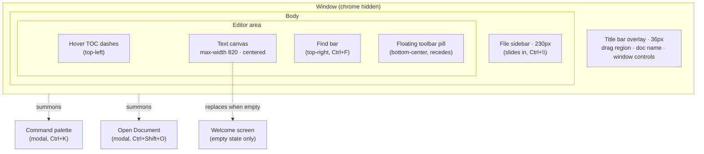

**Hierarchy rationale:** the text canvas is the only *permanent* element. The sidebar, find bar, palette, and quick-open are all *summoned* and dismissed; the toolbar and TOC are *ambient* (present but designed to be ignorable). The title bar is the single always-visible band, and even it is a transparent gradient rather than a solid bar.

---

## 4. Design tokens

All tokens live in [`lib/theme.dart`](../notbad-flutter/lib/theme.dart) as a palette value object — one construction site for every color in the app.

### 4.1 Color — surfaces & text

| Token | Light | Dark | Used for |
|---|---|---|---|
| `bg` | `#F7F6F3` warm paper | `#2D2D2D` neutral warm | Editor canvas, window ground |
| `sidebarBg` | `#EFEDE9` | `#252525` | Sidebar surface (one step darker) |
| `fg` | `#2C2C2B` | `#E6E5E2` | Body text |
| `muted` | `#8F8E8A` | `#98978F` | Secondary text, icons, blockquotes |
| `marks` | `fg` @ 25% | `fg` @ 28% | Revealed syntax marks |
| `codeBg` | `#EBEAE6` | `#383838` | Inline code & fence background |
| `border` | `#E2E1DD` | `#454545` | Hairlines, field outlines |
| `toolbarBg` | `#FFFFFF` | `#3A3A3A` | Floating pill, popovers, TOC panel |

Deliberately **not** pure white / pure black: the light theme is warm paper (`#F7F6F3`), inspired by Kenya Hara's design philosophy: "the canvas should feel like white — receptive, not sterile."

### 4.2 Color — accents

Each accent is tuned *separately* per appearance (a light-mode blue is illegible on dark, and vice versa):

| Accent | Light | Dark |
|---|---|---|
| Amber | `#9A6700` | `#D4A72C` |
| Crimson | `#CF222E` | `#F47067` |
| Fern | `#1A7F37` | `#57AB5A` |
| Teal | `#0F766E` | `#2DD4BF` |
| Azure *(default)* | `#0969DA` | `#4493F8` |
| Graphite | `#57606A` | `#8B949E` |

The accent colors exactly five things: the caret, text selection (@25%), links, list/task markers, and active toolbar states. Everything else is grayscale — so the accent always *means* something.

### 4.3 Typography

| Token | Value | Notes |
|---|---|---|
| Body face | System UI (Segoe UI / SF / system) | Prose app → native rhythm |
| Body size | `15.5px` default | Zoom: `Ctrl+=`/`-`/`0`, clamped 11–28 |
| Line height | `1.85` default | Presets: Tight 1.6 · Normal 1.85 · Relaxed 2.1 |
| Letter spacing | `0.1` | |
| H1 / H2 / H3 | ×1.6 / ×1.35 / ×1.15, weight 700 | H4–H6: ×1.0 bold |
| Paragraph gap | Blank lines get line-height ×1.25 | Breathing room without fake margins |
| Mono stack | Consolas → Menlo → DejaVu Sans Mono → monospace | Code −1.5px; frontmatter −2.5px |
| UI text | 12–14.5px | Palette rows 14.5, categories 12.5, tooltips 12 |

### 4.4 Shape & elevation

| Token | Value |
|---|---|
| Radius: row selection | 6 |
| Radius: find bar / TOC panel | 10 |
| Radius: palette / quick-open card | 14 |
| Radius: toolbar pill | 22 |
| Radius: caret | 2px wide, radius 1 |
| Elevation: toolbar pill | 6 |
| Elevation: find bar / TOC panel | 8 |
| Elevation: palette | 16 + 25% shadow |

### 4.5 Layout metrics

| Token | Value |
|---|---|
| Title bar height | 36 |
| Sidebar width | 230 |
| Content max-width | 820 |
| Content gutters | 56 |
| Toolbar offset from bottom | 16 |
| Sidebar row height | 28 |

### 4.6 Motion

| Interaction | Duration | Curve |
|---|---|---|
| Palette / quick-open open | 140ms | easeOutCubic, scale 0.97→1 + fade |
| TOC dashes ⇄ panel | 160ms | cross-fade |
| Sidebar slide | 220ms | easeOutCubic |
| Scroll-to (TOC jump, find) | 220ms | easeOutCubic |
| Toolbar fade | 250ms | easeOut |

Nothing bounces, nothing springs. Motion here is *acknowledgement*, not decoration — every animation answers "did my input register?" in under a quarter second.

---

## 5. UI element inventory

### 5.1 Title bar (custom chrome)

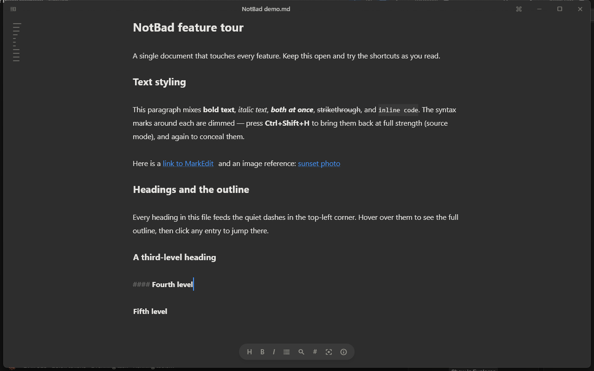

The OS title bar is hidden. In its place, a 36px transparent strip whose background is a vertical gradient (`bg` @92% → transparent) so scrolled text dissolves under it rather than hitting a hard edge:

```
[sidebar ⊟]  ·······  Document name — Edited  ·······  [⌘] [—] [□] [✕]
```

- **Left:** sidebar toggle at 55% opacity — present but quiet.
- **Center:** document name (semibold, `fg` @75%) + gray "— Edited" dirty marker; the whole strip is a drag region; double-click maximizes.
- **Right:** a command-palette button (mouse-user discoverability), then custom caption buttons — 44px hit targets, close turns `#E81123` on hover, maximize swaps to a restore glyph. On macOS these are omitted (native traffic lights remain).

### 5.2 The editor canvas & concealment

| Concealed (default) | Marks visible |
|---|---|
|  | 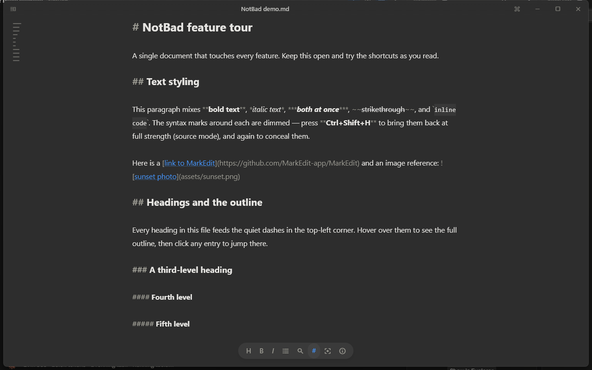 |

Three view modes, one keystroke apart (`Ctrl+Shift+H`):

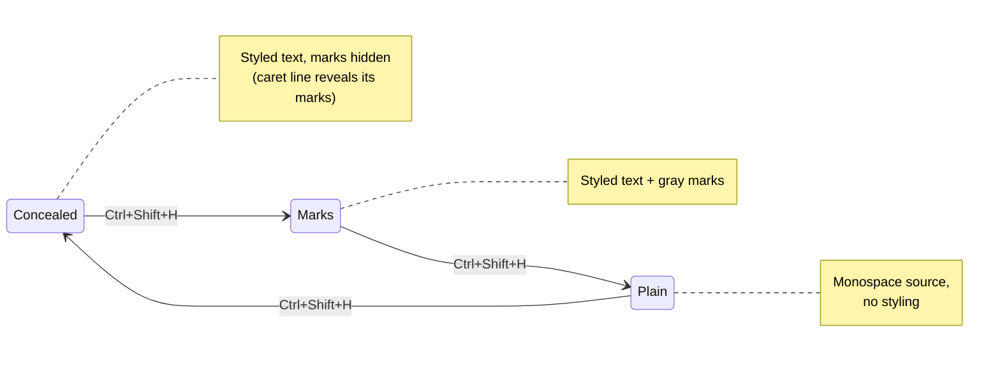

**The caret-line reveal** is the load-bearing UX decision. Fully hidden marks make editing unpredictable (invisible characters under the caret). Obsidian's answer — reveal marks on the active line — keeps editing honest while the rest of the document reads clean. Tradeoff accepted: the active line reflows slightly as marks appear/disappear. Mode 2 exists precisely for people who dislike that reflow.

What *never* conceals, even in mode 1: list bullets, `[ ]` checkboxes, blockquote `>`, and horizontal rules — because they *are* the visual, not plumbing around it.

### 5.3 Floating toolbar pill

```
( H  B  I  ≡  🔍  #  ⊕  ⓘ )
```

Eight actions prose actually needs: heading cycle, bold, italic, list toggle, find, view mode, focus mode, statistics. Letter glyphs (`H B I`) instead of icons where the letter *is* the clearest icon. Word count intentionally lives *behind* ⓘ, not beside it — an always-visible count nags; a one-click count informs.

**The recede behavior:** the pill fades to 0 opacity the moment text changes and returns on any mouse movement. The writer's hands are on the keyboard → the mouse affordance is irrelevant → remove it. This one 250ms fade does more for the "quiet" feel than any color choice.

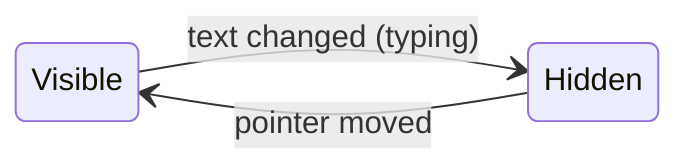

### 5.4 Hover table of contents

Quiet dashes in the top-left — one per heading, width encodes depth (18px for H1, −4px per level). Hovering cross-fades the dashes into a full outline panel; clicking jumps (with exact scroll positioning via text-layout measurement). The dashes are a *map you can ignore*: 2px tall, muted @55%.

### 5.5 File sidebar

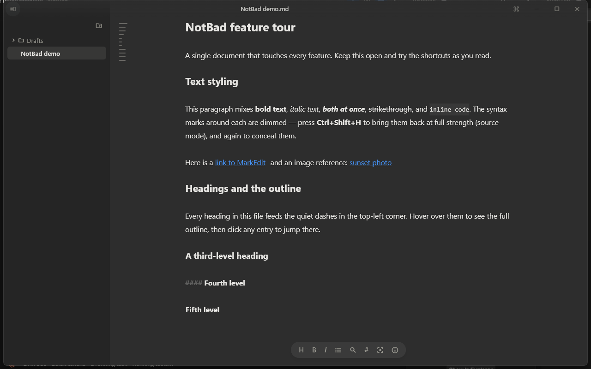

A tree of writing files (`.md/.markdown/.txt/.text`) rooted at the document's folder or a chosen root. Design choices:

- **Files have no icons** — a list of names reads faster than a grid of identical page glyphs. Folders keep chevron + icon because they're *interactive containers*.
- **Extensions stripped** — "Reading list", not "Reading list.md".
- **Keyboard-driven** (Obsidian-style): opening the sidebar focuses it; ↑/↓ browse, → opens, ← collapses or jumps to parent, Esc returns to the editor. The keyboard highlight (accent outline @45%) is distinct from the open-file highlight (fg @9% fill).
- **Live**: a filesystem watcher refreshes the tree on external changes, debounced 300ms.

### 5.6 Command palette

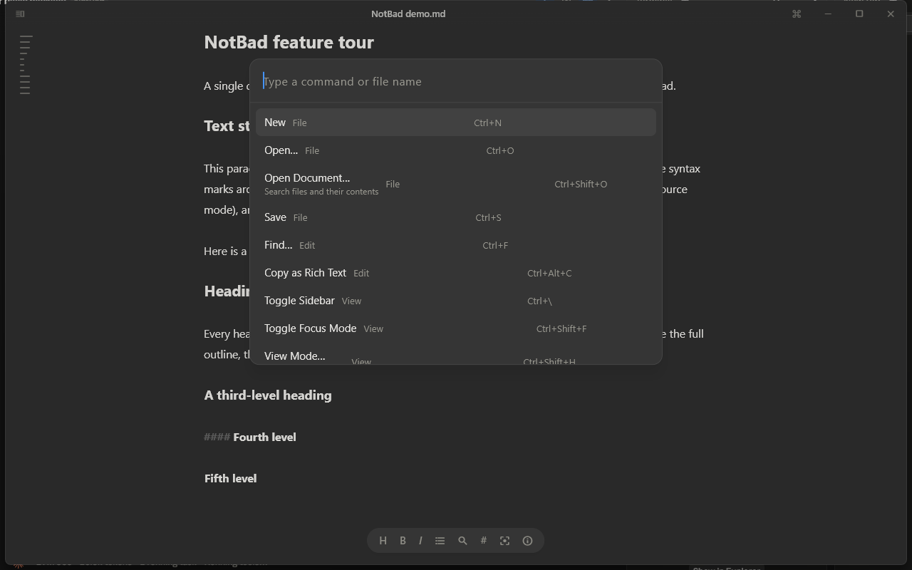

The app's entire surface area, searchable. Anatomy: 580px card, 14px radius, "Type a command or file name" prompt, rows of *title · gray category · right-aligned shortcut*, checkmarks on active states, color swatches in the accent picker. No icons — text ranks better than pictograms when scanning verbs.

**The v2 redesign (driven by real feedback):** the flat list grew to ~30 rows and the user called it "long and too complex." The fix is a two-level structure with a search escape hatch:

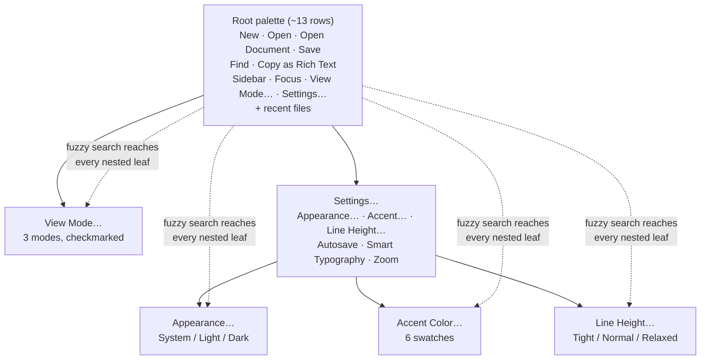

The crucial property: **nested items remain fuzzy-searchable from the root** (`searchOnly` flag — hidden while browsing, matched while typing). Typing "dark" still switches appearance in two keystrokes; browsing shows a dozen rows instead of thirty. Parents display their current value as a subtitle ("Settings… — Azure · System · Autosave") so state is visible without descending.

### 5.7 Find & replace bar

Docked top-right (not a modal — the text must stay visible while searching). Live match count ("3/12"), all matches highlighted accent @28%, current match @55%, Enter/Shift+Enter to step, expandable replace row. Esc closes and returns focus to the editor.

### 5.8 Focus mode

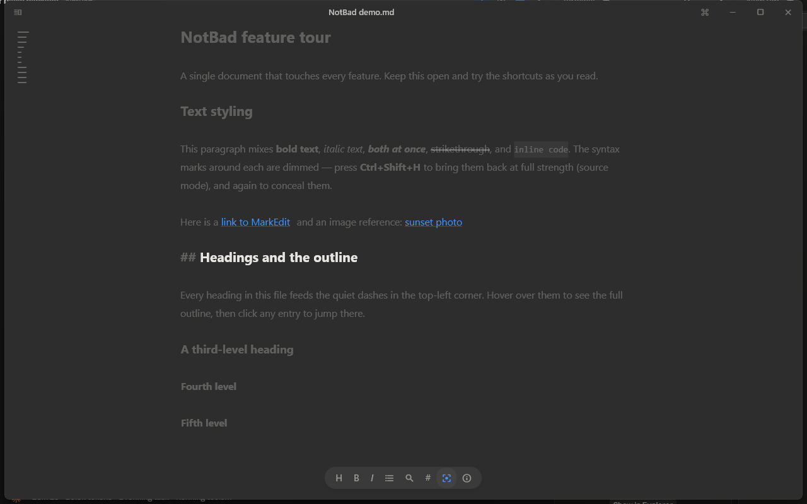

Everything but the caret's paragraph dims to `fg` @28%; typewriter scrolling holds the caret vertically centered (measured with a real text-layout pass, not estimated). The dimming boundary is the *paragraph*, not the line — sentences need their neighbors.

### 5.9 Welcome screen

Shown only when there is truly nothing: no session to restore, no draft, empty buffer. Wordmark, one-line promise, New/Open buttons, five recent files, and the single most important lesson for a chrome-less app: *"Ctrl+K for everything else."* It vanishes on the first keystroke.

---

## 6. Interaction design deep-dives

### 6.1 Document lifecycle (trust model)

The app must never lose words. Every path a document can take:

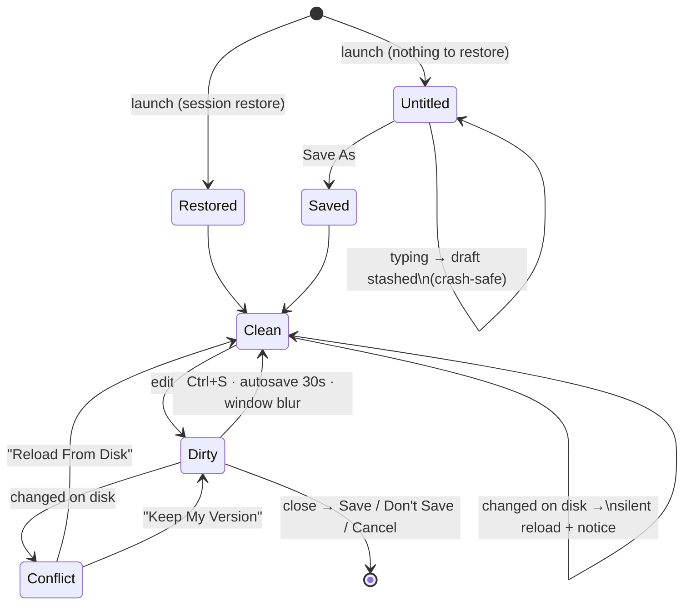

Supporting decisions: CRLF/LF preserved per file; caret position restored on relaunch; second launches hand their file to the running window (single instance) instead of spawning a confused twin.

### 6.2 The styling pipeline (how concealment works)

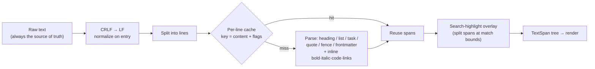

Concealed marks are painted transparent at near-zero size — they still *exist* at their offsets, so selection, undo, find, and caret math never diverge from the file. The per-line cache means a keystroke restyles one line, not the document; large files stay at typing latency.

### 6.3 Smart editing defaults

- **Enter** continues lists (`-`, `1.` auto-increments, `- [ ]` fresh checkbox); Enter on an empty item exits the list. Tab/Shift+Tab indent.
- **Auto-pairing**: type a mark with a selection to wrap it; `(`/`[`/`` ` `` auto-close; typing the closing half skips an existing one.
- **Ctrl+B/I with no selection** wraps the word under the caret — the 90% case.
- **Click** a checkbox to toggle it; **Ctrl+click** a link to open it.
- **Smart typography** (opt-in): curly quotes, `--` → em dash.

Each of these removes a micro-friction that, repeated hundreds of times per session, is the difference between a tool and a companion.

---

## 7. Decision log

| Decision | Alternatives considered | Why this |
|---|---|---|
| Pure Flutter re-implementation | Reuse CodeMirror in a webview | "Lightweight + identical everywhere" was the brief; desktop webviews are heavy and uneven (weak on Linux) |
| Marks concealed via transparent spans | True text hiding (custom layout engine) | 1:1 caret↔source mapping for free; the custom engine remains future work for rendered code panels/images |
| Caret-line mark reveal | Fully hidden always | Editing invisible characters is disorienting; predictability beats purity |
| Two-level palette + search-through | One flat list · a settings window | Flat list didn't scale past ~20 items (real user feedback); a settings window contradicts "words are the interface" |
| Word count behind ⓘ | Always-visible counter | A live counter is a persistent nag; on-demand access preserves focus |
| Receding toolbar | Static toolbar · no toolbar | Mouse affordances shouldn't cost keyboard users anything |
| Warm paper `#F7F6F3` | Pure white / GitHub palette | Standard IDE colors read as a "developer tool", not a peaceful "writing paper" |
| Sidebar files without icons/extensions | Standard file-tree look | Reads as a list of *writings*, not a file manager |
| Native title bar hidden | Standard OS chrome | The one big band of non-content; its removal is most of the "seamless" feel |
| Per-user installer (no admin) | MSI system-wide | Writers install their own tools; also enables clean MSIX path later |

---

## 8. Accessibility & internationalization — honest status

**Done:** every icon-only control has a tooltip (doubling as a semantic label, including custom caption buttons); full keyboard operability for every feature; respects OS light/dark; text scaling via zoom persists.

**Not done yet:** screen-reader testing of the custom editor styling; high-contrast mode; RTL layout; UI localization (English only). These are tracked as design debt, not ignored — an app about words owes its users' languages more than this.

---

## 9. Outcomes

| Metric | Value |
|---|---|
| Cold start → typing | ~1s |
| Installed size | ~29 MB (10.8 MB installer) |
| Lines of app code | ~3.5k Dart (vs typical 30k+ lines in legacy desktop editors) |
| Test suite | 8 tests: view modes, CRLF, lists, search, welcome |
| Platforms from one codebase | 3 (CI builds all) |

And one unmeasurable: the resting state of the app is a piece of paper with your words on it. That was the whole brief.

---

## 10. Strategic Product & Technical Roadmap

### 10.1 Core Editor & Typography (Highest Impact)
1. **Syntax Highlighting in Code Fences:** Integrate a palette-aware Dart syntax highlighter so code fences display subtle, legible tokens without webviews.
2. **Inline Image Previews & Attachments:** Render local and relative image links (``) seamlessly between paragraphs with gentle rounded styling.
3. **Native Spellcheck & Suggestion Menus:** OS spellcheck integration rendering quiet red/amber wavy underlines with right-click replacements.
4. **Markdown Table Grid Rendering:** Render pipe tables as clean, aligned hairline grids with keyboard cell navigation.
5. **Math / LaTeX Expressions:** Native parsing and rendering for `$ ... $` and `$$ ... $$` equations.

### 10.2 Writer Workflow Superpowers
1. **Daily Word Goals & Progress Ring:** Non-nagging session targets in the Statistics popover (`ⓘ`).
2. **Git Gutter Indicators in Sidebar:** Quiet status dots (`•` modified, `+` untracked) for version-controlled writing repositories.
3. **Tactile Typewriter Audio (Opt-In):** Subtle mechanical key clicks and haptic drafting feedback.
4. **Expanded Export Ecosystem:** Clean, publication-ready PDF export with custom typography presets alongside HTML export.

### 10.3 Architecture & Engineering Refactoring
1. **Modular Decomposition of `editor_screen.dart`:** Split into `FindReplaceOverlay`, `WindowHeaderBar`, `DocumentLifecycleManager`, and `EditorToolbarPill`.
2. **Custom RenderObject Layout Engine:** Move toward hybrid text/widget layout for native inline interactive elements with 1:1 caret mapping.
3. **Cross-Platform Golden UI Tests:** Automated pixel-comparison tests across Windows, macOS, and Linux runners.

### 10.4 Accessibility & Platform Polish
1. **Screen Reader Semantic Filter:** Clean prose filtering for NVDA/VoiceOver when marks are concealed.
2. **High-Contrast & E-Ink Theme:** True monochrome preset (`#000000` / `#FFFFFF`) optimized for low-power E-Ink displays.
3. **Community Linux Packaging:** Flathub Flatpak and Snapcraft distribution.

---

*Screenshots and the [demo video](../.github/assets/demo.mp4) were captured from NotBad 1.0.0 on Windows 11. Diagrams are Mermaid, rendered natively by GitHub.*
