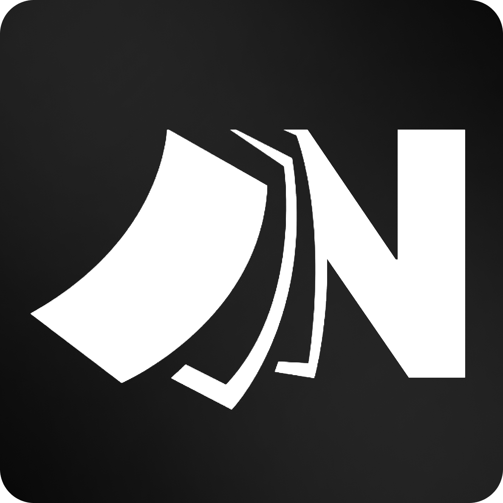

<p align="center">
  
</p>

<h1 align="center">NotBad</h1>

<p align="center">
  <em>A lightweight, cross-platform Markdown writer for <strong>Windows, macOS, and Linux</strong>, written in Flutter.</em>
</p>

---

NotBad is designed from the ground up as a pure-Flutter desktop writing application: no embedded web views, no heavy browser processes. The Markdown-aware editor is implemented natively in Dart, so the app stays small (~28 MB), starts instantly, and behaves identically on every desktop platform.

## Features

- **Markdown styled as you type** — headings, bold, italic, strikethrough, inline code, code fences, links, lists, task checkboxes, and blockquotes are rendered live in the editor. Syntax marks (`**`, `#`, `` ` ``…) are dimmed toward the background; `Ctrl+Shift+H` brings them back as a source mode.
- **Focus mode** (`Ctrl+Shift+F`) — dims everything except the paragraph you're working on.
- **File sidebar** (`Ctrl+\`) — a tree of the writing files around your document, or rooted at a folder you pick.
- **Command palette** (`Ctrl+K`) — every action, fuzzy-searchable, with recent files.
- **Floating toolbar** — heading, bold, italic, code, syntax visibility, focus mode, and a live word count.
- **One theme, done well** — Warm Paper light / Neutral Warm dark following the system (or pinned), with six accent colors: Amber, Crimson, Fern, Teal, Azure, Graphite.
- **Plain `.md` files on disk** — open/save/save-as with unsaved-change protection. No library, no lock-in.

Keyboard shortcuts use `Ctrl` on Windows/Linux and also accept `Cmd` on macOS.

## Building

```bash
flutter run -d windows   # or: -d macos / -d linux
flutter build windows    # release build
flutter test             # run widget test suite
```

## Deliberately omitted

Preview panes, split views, AI sidebars, and heavyweight webview bloat. Planned future enhancements: native spellcheck, rendered code panels, inline images, and clean PDF export.
